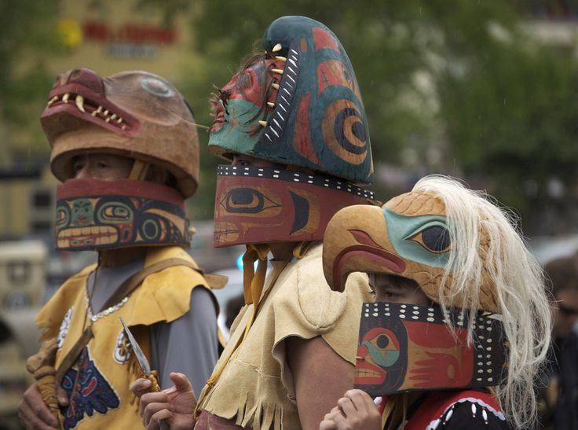
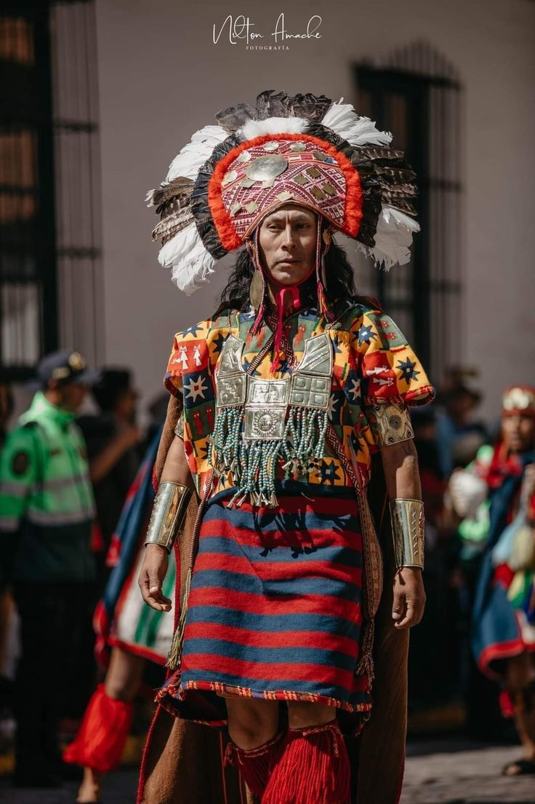
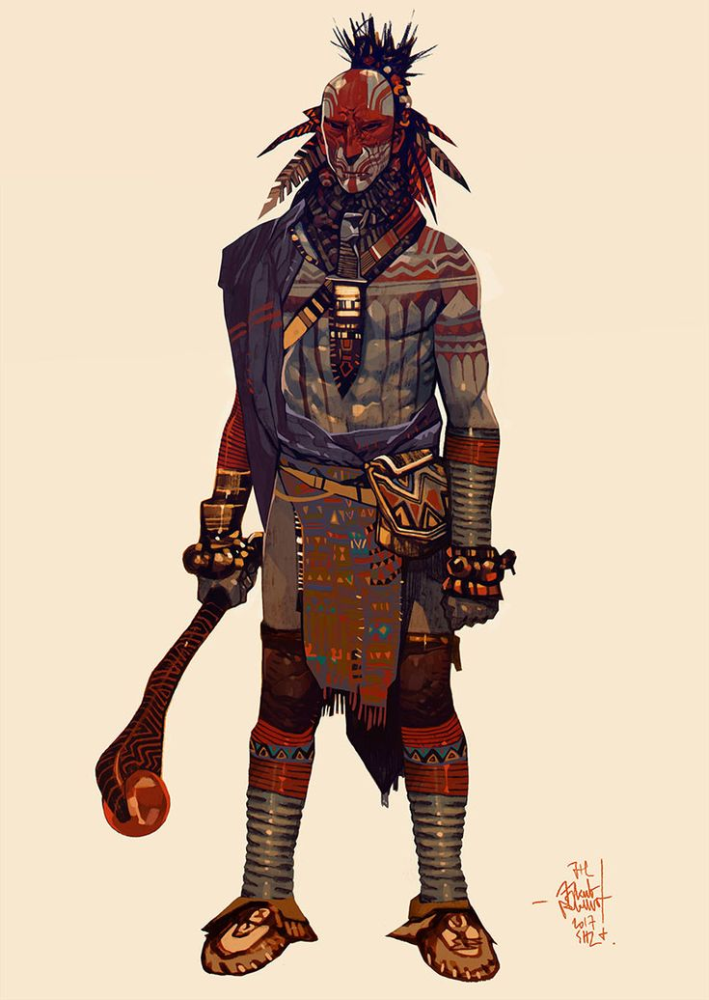
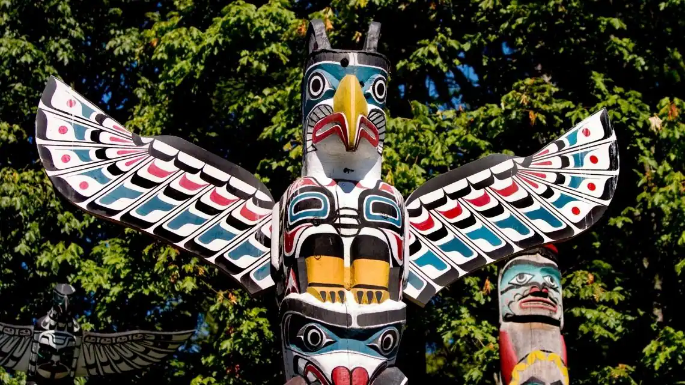
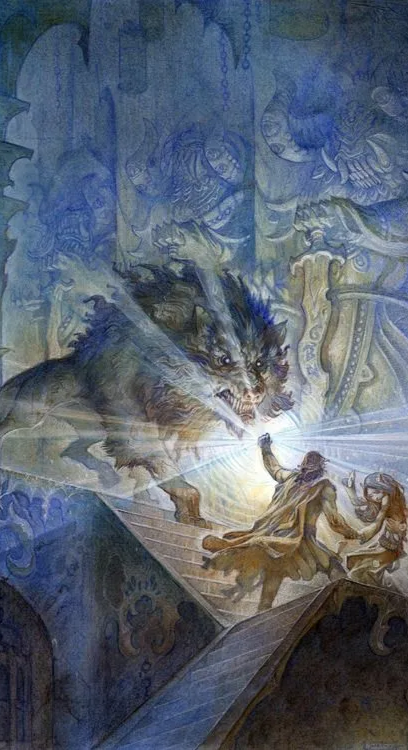

# História e Narrativa

Este documento apresenta as bases culturais e históricas que inspiram o universo do jogo, explicando como essas referências são adaptadas para criar uma experiência única de fantasia.

---

## Referências Culturais e Históricas

A estética e a narrativa do jogo são inspiradas em culturas indígenas das Américas, como as civilizações Asteca e Maia, os povos Tupi e Guarani do Brasil, e tribos norte-americanas como os Cherokee. Cada cultura contribui com simbolismos, mitologias e tradições, reinterpretados para formar um universo de fantasia coeso.

### Referências Culturais

- **Astecas e Maias**: Elementos como pirâmides escalonadas, calendários cerimoniais, máscaras rituais e deuses ligados à natureza;
- **Tupi e Guaranis**: Mitos da criação, figuras espirituais como pajés (líderes espirituais indígenas) e forte conexão com fauna e flora;
- **Cherokees e Norte-Americanos**: Símbolos totêmicos, histórias de espíritos animais e uso cerimonial de cores e padrões.

Esses elementos podem aparecer em cenários, personagens e sempre de forma estilizada e respeitosa.

### Adaptação para o Universo de Fantasia

Inspirando-se na forma como Tolkien adaptou mitologias nórdicas, celtas e cristãs, este universo será um **épico local**, reinterpretando mitologias indígenas para criar uma cosmologia própria.

As adaptações seguem três princípios:

- **Mitologias Reimaginadas**: Divindades, heróis e monstros são criados a partir de conceitos dessas culturas, ajustados para formar uma cosmologia única. Por exemplo, um deus asteca do sol pode se tornar um governante celestial que concede poderes mágicos a certos clãs.

- **Narrativa Épica**: A história se estrutura em ciclos míticos e históricos, com temas de criação, destruição e renascimento. Esses ciclos formam a base da lore do mundo, como os ciclos das Silmarils e batalhas do Legendarium de Tolkien (Silmarils: joias míticas da obra de Tolkien).

- **Representação Simbólica**: Aspectos visuais (arquitetura, vestimentas, armas) e narrativos (rituais, tradições, idioma) são representados de forma estilizada, capturando o espírito e simbolismo cultural, sem reproduções literais.

Essas escolhas reforçam a identidade do jogo, promovendo uma experiência rica, respeitosa e única, baseada na diversidade e profundidade das culturas indígenas das Américas.
