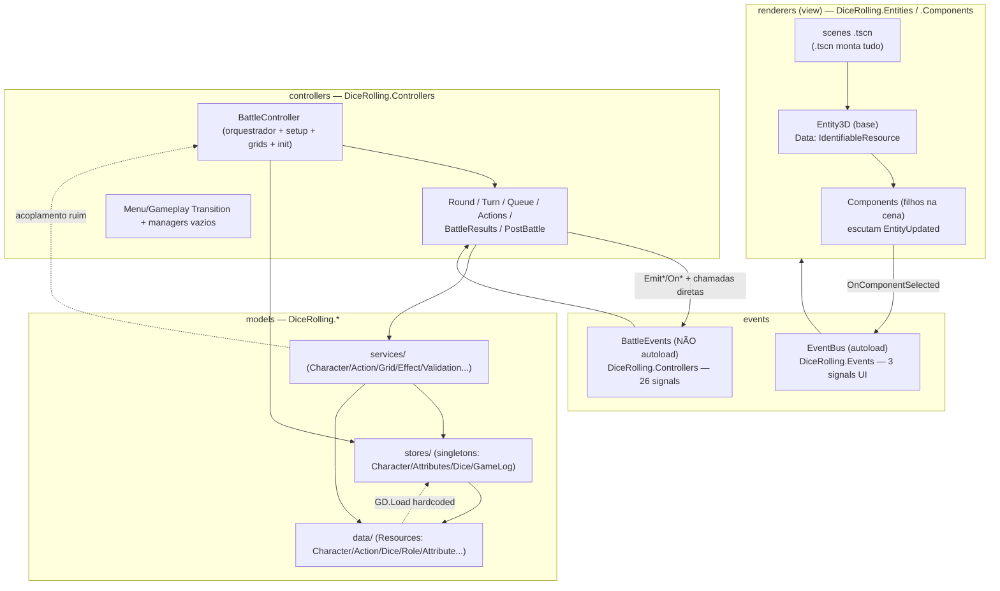

# Firebound — Análise Arquitetural Exaustiva

<!-- markdownlint-disable MD013 -->

> **Data:** 2026-06-18
> **Escopo:** todo o código em `src/` (exceto artefatos de build em `src/.godot/`), docs em `docs/`, configuração de projeto e roadmap.
> **Objetivo:** diagnóstico para retomada do projeto após meses afastado. **Não** contém correções — apenas mapeamento, avaliação de decisões e pontos fortes/fracos.
> **Método:** varredura automatizada em 5 frentes paralelas (models, events, controllers, renderers, meta/docs). As referências `arquivo:linha` vêm dessa varredura e podem ter deslocado alguns números desde então — confira antes de agir.

---

## 0. TL;DR — o que importa

1. **A camada `renderers` (entity/component) é a maior dor, e a percepção está correta.** Há 5+ camadas de indireção entre o `Resource` de dados e o pixel na tela, acopladas por `GetParent<T>()`, `NodePath` exportados e ordem de `_Ready()`. Composição dinâmica aninhada (Grid → Cell → Character → Model) gera race conditions — há até um loop infinito "resolvido" por código comentado.
2. **O sistema de eventos está semiquebrado.** Dois hubs (`EventBus`, `BattleEvents`) com namespaces inconsistentes; ~12 signals emitidos sem ouvintes e ~5 ouvintes sem emissor. O fluxo de batalha só funciona porque há **chamadas diretas** entre controllers escondidas por trás dos eventos.
3. **Os controllers de batalha estão confusos pelo mesmo motivo: indireção via cascata de signals + lógica de teste rodando em produção.** A máquina de estados (`BattleState`/`RoundState`) em si é sólida; o problema é o fluxo invisível e o `BattleController` fazendo 6 coisas.
4. **`models/` é a parte mais madura (~99% real).** A direção que você gostou se confirma. O único excesso é a **proliferação de interfaces** (`I*Sheet`, `I*Information`, `I*Assets`, `I*Values`) — cerimônia sem benefício polimórfico.
5. **Não existe fronteira física framework-vs-jogo.** Tudo é `DiceRolling.*` num assembly só (`dice-rolling`). O rename para "Firebound" foi só cosmético (README/docs); o código não foi migrado. Docs de API estão desatualizadas (`res://features/...`, classes que não existem mais).

---

## 1. Mapa da arquitetura (estado real)



**Dependências problemáticas marcadas com linha pontilhada:**

- `ActionService` lê `BattleController.Instance.EnemySquadLocation` → service (model) depende de controller.
- `AttributesStore` faz `GD.Load("res://resources/Attributes/AttributesStore.tres")` hardcoded.

---

## 2. Inventário por camada (responsabilidade × maturidade)

| Camada | Namespace | Responsabilidade real | Maturidade | Veredito |
| --- | --- | --- | --- | --- |
| `models/data` | `DiceRolling.*` (Actions, Characters, Dice…) | Resources de domínio (CharacterType, ActionType, DiceType, RoleType, AttributeType, GridType…) | **~99% real** | Sólido. Excesso de interfaces. |
| `models/services` | `DiceRolling.Services` | Regras: init de atributos/ações, affordance de energia, alvos válidos, grid, efeitos, validação | **~95% real** | Bom; lógica duplicada e 1 acoplamento a controller. |
| `models/stores` | `DiceRolling.Stores` | Estado runtime (singletons): Character, Attributes, Dice, DiceEnergy, DiceIcon, GameLog | **100% real** | Funciona; estratégias de singleton inconsistentes. |
| `helpers` | `DiceRolling.Helpers` | Utilitários (lookup atributo/energia, busca de nós) | 100% real | OK; duplica lógica de stores. |
| `events` | `DiceRolling.Events` **e** `.Controllers` | 2 hubs de signals (UI + batalha) | parcial | **Fraco.** Ver §4. |
| `controllers` (batalha) | `DiceRolling.Controllers` | Máquina de estados de batalha em 7 controllers | **~68% real** | Confuso por fluxo invisível + mocks. Ver §5. |
| `controllers` (menu/cena) | `DiceRolling.Controllers` / `.Dungeon` / `.MenuControllers` | Transições + 4 managers de cena | Transições 100%; managers **vazios (0%)** | Esqueletos. |
| `renderers/entities` | `DiceRolling.Entities` | Entity3D/2D/Control + concretas (Character, Grid, GridCell, Inspector) | ~80% | Padrão data-driven; race conditions. Ver §6. |
| `renderers/components` | `DiceRolling.Components.*` | Componentes filhos que escutam `EntityUpdated` | ~70–90% | **Dor principal.** Ver §6. |
| `renderers/components/_to_refactor` | — | GameLog, Inventory, Tooltip, TurnOrder | 40–60% | Débito técnico explícito. |
| `tests` | `DiceRolling.Tests.*` | 4 classes, ~6 casos | <10% cobertura | Só happy-path; zero testes de services/stores/controllers. |

**Dimensão (VSCodeCounter, 2025-05-03):** ~124 arquivos C# / ~5.054 LOC de código C#. `renderers` 5.195 LOC é a maior camada de código; `models` 1.781 LOC; `controllers` 943 LOC; `events` apenas 123 LOC. `addons/` (third-party) domina o repositório em volume mas não é seu código.

---

## 3. `models/` — a base que você gostou (e por quê continuar)

**Pontos fortes confirmados:**

- Modelagem data-driven em cima de `Resource`/`IdentifiableResource` → serialização e hot-reload no editor de graça, `EmitChanged()` reativo.
- Separação clara `data` / `services` / `stores`.
- Validação centralizada (`ValidationService`) chamada nos construtores.
- `DiceFactory` limpo; genéricos usados com parcimônia (`IDice<T>`, `IAction<TContext,TResult>`).
- Fluxo de dados coerente: `RoleType` (template) → `CharacterType` (instância) copia `RoleAttribute`→`CharacterAttribute` com Base/Max/Current.

**Pontos fracos:**

| Problema | Evidência | Severidade |
| --- | --- | --- |
| **Proliferação de interfaces** — `ICharacter` compõe 5 sheets; `IAttribute` 4; `IAction` 5. ~250 LOC de interface pura para 6 classes, sem nenhuma implementação parcial que justifique. | `ICharacter.cs:9-15`, `IAttribute.cs:8-12`, `IAction.cs:9-13` | **Alta** (custo de manutenção, zero ganho) |
| **Cache manual sem invalidação** — `CharacterType` mantém 3 `Dictionary` de valores de atributo; mutação direta de `Attributes[]` deixa cache obsoleto. | `CharacterType.cs:26-28`, getters `162-188` | Média (bug latente) |
| **Lógica duplicada** — `CharacterAction.Resolve()` ≡ `EffectService.ApplyEffects()`; `CanAffordAction()` e `ConsumeEnergy()` repetem o match de energia. | `CharacterAction.cs:23-31` vs `EffectService.cs:7-11`; `ActionService.cs:24-68/134-157` | Média |
| **Service depende de controller** — `ActionService.GetValidTargets()` lê `BattleController.Instance.EnemySquadLocation`. Inverte a dependência (model→controller). | `ActionService.cs:104` | **Alta** (quebra camadas) |
| **Validação incoerente** — `ValidationService` retorna `bool`, mas construtores lançam `ArgumentException`. Duas filosofias. | `ValidationService.cs:10-40` vs `AttributeType.cs:88-96` | Baixa |
| **`AttributesStore` carrega disco hardcoded** | `AttributesStore.cs:15-16` (tem TODO próprio) | Média |
| **Falhas silenciosas / crashes** — `GameLogStore.AddGameLogLine()` quebra se `Messages` vazio; `GetCharacterById()` lança se não achar. | `GameLogStore.cs:38-46` | Média |

---

## 4. `events/` — repensar é a decisão certa

### 4.1 Os dois hubs

- **`EventBus`** (`DiceRolling.Events`, **é autoload** em `project.godot`): 3 signals de UI/seleção — `ComponentSelected`, `ComponentUnselected`, `ActionSelected`.
- **`BattleEvents`** (`DiceRolling.Controllers` ← **namespace errado**, **não é autoload**): 26 signals cobrindo as 4 fases da batalha (setup → rounds → result → post).

### 4.2 Signals órfãos (o sintoma mais grave)

**Emitidos mas ninguém escuta (~12):** `ActionSelected`, `BattleStarted`, `BattlePaused`, `BattleResumed`, `EnemiesGenerated`, `InitiativeQueueSetup`, `PlayerEnergyRolled`, `TurnStarted`, `ActionPerformed`, `CharacterMovedToEndOfQueue`, `BattleResultChecked`, `SceneTransitioned`, `RewardsDistributed`, `GameOver`.

**Escutados mas nunca emitidos (~5):** `CharacterInitiativeModified`, `PlayerTargetSelected`, `PlayerActionCancelled`, `CheckNextTurn`, `CheckNextRound`.

> Isso significa que **>50% dos eventos definidos não estão realmente em uso.** O sistema *parece* completo mas é fachada.

### 4.3 Por que "funciona" mesmo assim

Porque os controllers se chamam **diretamente**, não via evento:

- `RoundController` chama `ActionsController.StartActionsDeclaration()` direto (`RoundController.cs:103`).
- `TurnController` chama `QueueController.GetNextCharacter()` direto (`TurnController.cs:88`).
- Controllers irmãos se acham por `GetParent()?.GetNode<T>(name)` (magic strings).

Ou seja: há **dois sistemas de comunicação concorrentes** (signals + chamadas diretas), e o de signals está em grande parte morto.

### 4.4 Outros problemas

- **Type-safety mista:** `BattleStarted(Godot.Collections.Array, Array)` (fraco) vs `PlayerTargetSelected(CharacterType, CharacterType)` (forte).
- **Singleton frágil:** `BattleEvents.Instance` assume autoload `/root/BattleEvents` que não existe; cai no fallback `new BattleEvents()` (instância solta).
- **Mistura `+=` (C# delegate) com `.Connect()`** entre os consumidores.
- **Self-events:** `ActionsController` e `QueueController` emitem e escutam o próprio signal.

**Veredito:** consolidar em **um** bus, autoload garantido, namespace correto, signals tipados e organizados por categoria (`UI.*`, `Battle.*`). Decidir explicitamente o que é evento (fan-out, desacoplado) vs. o que é chamada direta (sequência determinística) — hoje está misturado sem critério.

---

## 5. `controllers/` — confusão tem causa identificável

### 5.1 A máquina de estados é boa

`BattleState` (Start→InProgress→End) e `RoundState` (RoundStart→ActionsDeclaration→TurnsResolution→RoundEnd→loop) são **enums type-safe, bem nomeados e documentados**. `QueueController` (~95% pronto, tie-breaking e repopulação corretos) e `RoundController` (~90%) são os mais sólidos.

### 5.2 As 4 causas concretas da confusão

1. **Fluxo invisível por cascata de signals (≈60%):** ler `BattleController.StartBattle()` não revela que `RoundController.OnTransitionedToRounds()` vai disparar. Você precisa pular por `BattleEvents.cs` → handler → método para reconstruir a sequência mentalmente.
2. **Lógica de teste em produção (≈25%):** `ActionsController.DeclarePlayerActionsForTesting()` / `DeclareEnemyActionsForTesting()` rodam de verdade — input do jogador está mockado, não conectado a UI (`ActionsController.cs:78-79,133`). `BattleController.cs:128-131` tem bloco `// ! TODO - FOR TESTING`.
3. **`BattleController` faz 6 coisas (≈10%):** state, init de sub-controllers, **criação de grid** (devia ser `GridService`), **init de atributos/ações** (devia ser `CharacterService`), getters de team, debug. 381 LOC.
4. **Estado em hub-and-spoke (≈5%):** todo mundo puxa team/dados de `BattleController.Instance`.

### 5.3 Outros

- **`PostBattleController` é stub** (~20%): `ShowVictoryScreen()`/`ShowGameOverScreen()` só emitem signal (`PostBattleController.cs:36-56`).
- **`ShouldBattleContinue()` chamado em 2 lugares** (`RoundController.cs:135`, `TurnController.cs:168`) — sem fonte única de verdade.
- **4 managers de cena vazios:** `MainMenuManager`, `LobbyManager`, `DungeonManager`, `GameOverManager`.
- **Singleton frágil + `CallDeferred`** para encadear turnos (`TurnController.cs:163`).

---

## 6. `renderers/` — a dor principal, dissecada

### 6.1 O padrão

`Entity3D` (base) é um **container de dados**: tem `Data: IdentifiableResource` e, ao setar `Data`, emite `EntityUpdated`. Os **Components** são nós-filhos na cena que, no `_Ready()`, fazem `GetParent<Entity3D>()`, assinam `EntityUpdated` e se redesenham. Concretas: `CharacterEntity`, `GridEntity`, `GridCellEntity`, `CharacterInspectorEntity`.

### 6.2 As 5+ camadas de indireção

```text
Resource (.tres)
  → Entity.Data (setter dispara signal)
    → EntityUpdated
      → Component._parent (GetParent<T> / FindAncestorOfType<T>)
        → renderização (Sprite3D/Label/Mesh)
          → instanciação dinâmica de Entities/Components filhos
```

Composição aninhada real: `GridEntity` → `GridContainerComponent` instancia `GridCellEntity` → `CharacterGridCellComponent` instancia `CharacterEntity` → instancia `AnimatedModel3DComponent`/`SelectableComponent`.

### 6.3 Por que montar em cena dá bug (causas-raiz)

| # | Causa | Evidência |
| --- | --- | --- |
| 1 | **`GetParent<T>()` assume filho direto.** Inserir qualquer nó intermediário → `null` silencioso. | `SelectableComponent.cs:52`, `AnimatedSprite3DComponent.cs:20`, `GridContainerComponent.cs:27` |
| 2 | **Race condition em `_Ready()` vs `Data`.** Em composição dinâmica, `Data` é setado **antes** dos componentes-filho terminarem `_Ready()`/assinarem o signal → atualização inicial perdida. | `CharacterGridCellComponent.cs:25-40`, `UpdateCharacter():134-140` |
| 3 | **`NodePath` exportados frágeis.** Renomear/mover um nó na cena invalida o path; `GetNode()` quebra em runtime sem aviso no editor. | `GridCellComponent.tscn:10-13`, `CharacterAttributeDisplayComponent.tscn:14-16`, Tooltip (7 paths) |
| 4 | **Loop infinito já enfrentado** (resolvido por comentar código, não por redesenho): `IsOccupied`→`NotifyChanged()`→handler→`UpdateCharacter()`→… | `CharacterGridCellComponent.cs:90-95` (bloco comentado) |
| 5 | **`FindNodeOfType<T>()`** pega o primeiro match numa busca recursiva — frágil se a árvore muda. | `AnimatedModel3DComponent.cs:163`, `FindNodeOfType.cs` |
| 6 | **Acoplamento via EventBus global** para seleção: `SelectableComponent`→`EventBus.OnComponentSelected`→`CharacterInspectorEntity` que checa `is CharacterEntity`. Reuso fora desse contexto falha silenciosamente. | `SelectableComponent.cs:135`, `CharacterInspectorEntity.cs:56-77` |

### 6.4 `_to_refactor`

`GameLog`, `Inventory`, `Tooltip`, `TurnOrder` — padrão comum: **não herdam de Entity/Component**, dependem de `NodePath` múltiplos, duplicam nós manualmente (`.Duplicate()`), acoplam a singletons/globais (`GameLogStore.Instance`, `EventBus`, `TabContainer`). Marcados para refazer mas sem plano.

### 6.5 Diagnóstico

O padrão entity/component **funciona para hierarquias estáticas simples** (1 entity + N components filhos diretos) e **falha em composição dinâmica aninhada**. A elegância teórica (desacoplamento via signal) é anulada na prática por: acoplamento estrutural implícito (`GetParent`), configuração frágil (`NodePath`), e ausência de um ciclo de vida claro de "quando o Data está pronto".

---

## 7. Fronteira framework-vs-jogo & rename incompleto

- **Rename só cosmético:** README/docs dizem "FIREBOUND"; o código é todo `namespace DiceRolling.*`, assembly `dice-rolling`, `project.godot config/name="dice-rolling"`. (`dice-rolling.csproj:5,42`; `project.godot:13`)
- **Sem separação física:** não há `framework/` vs `game/`, nem assembly/namespace de core separado, nem pontos de extensão (interfaces abstratas) para um dev externo plugar conteúdo sem editar o core. Controllers e renderers importam tipos concretos do jogo diretamente. → **objetivo #1 do README (framework reutilizável) não está estruturalmente suportado hoje.**
- **Namespaces inconsistentes:** `DiceRolling.Controllers` vs `DiceRolling.MenuControllers` vs `DiceRolling.Dungeon` — sinais de refator em andamento.
- **Docs de API desatualizadas (drift):**
  - `docs/api/DiceRolling.Attributes.AttributesStore.md` aponta `res://features/Attribute/...` (pasta inexistente) e tipo `Dictionary<string,AttributeType>` (real é `Godot.Collections.Array<AttributeType>`).
  - `docs/api/DiceRolling.Battle.BattleManager.md` documenta classe `BattleManager` que **não existe** (real: `BattleController`).
  - Vários `DiceRolling.Lobby.*`, `DiceRolling.UI.*` referem nomes/namespaces fora de sincronia.
- **`.github/copilot-instructions.md`** tem ~3 linhas — não codifica nenhuma convenção arquitetural.

---

## 8. Diagnóstico das suas 4 insatisfações

| Sua percepção | Veredito | Base |
| --- | --- | --- |
| "Renderer (entities/components) tem indireção demais, montar em cena dá bug" | ✅ **Confirmado, e é o problema mais grave** | §6 — 5+ camadas, `GetParent` implícito, `NodePath` frágil, race conditions, loop infinito comentado |
| "Controllers ficaram confusos e abstratos" | ✅ **Confirmado, com causa clara** | §5 — fluxo invisível por cascata de signals + mocks em produção + BattleController sobrecarregado. A *máquina de estados* em si é boa. |
| "Eventos precisam ser repensados" | ✅ **Confirmado** | §4 — 2 hubs, >50% signals mortos, type-safety mista, comunicação duplicada (signals vs chamada direta) |
| "Models/services/stores/eventos bons, mas muito mockado" | ⚠️ **Parcial** | §3 — models/services/stores são ~95-99% **reais** (não mockados); o "mock" real está nos **controllers** (input do jogador) e na **UI pós-batalha**. Eventos NÃO estão bons (ver §4). |

> Correção de premissa: o que está mockado não é o `models/` — é o **input do jogador nos controllers** e a **UI de pós-batalha**. O `models/` é a parte mais pronta do projeto.

---

## 9. Dívida técnica priorizada por impacto

### 🔴 Alto impacto / fundacional

1. Redesenhar o padrão entity/component dos renderers (ou substituir por algo com ciclo de vida explícito de dados e sem `GetParent` implícito). — §6
2. Unificar e limpar o sistema de eventos; decidir evento vs. chamada direta. — §4
3. Definir a fronteira framework-vs-jogo (assembly/namespace/pontos de extensão) **antes** de crescer mais. — §7
4. Quebrar dependência `ActionService → BattleController`. — §3

### 🟠 Médio

1. Tirar lógica de grid/character-init do `BattleController` para os services. — §5.2
2. Concluir o rename `DiceRolling`→`Firebound` (ou decidir não fazer) — hoje é meio-termo confuso. — §7
3. Conectar input real do jogador; remover `*ForTesting` do caminho de produção. — §5.2
4. Implementar `PostBattleController` + managers de cena vazios. — §5.3
5. Resolver `_to_refactor` (4 componentes). — §6.4

### 🟡 Baixo

1. Reduzir interfaces `I*Sheet`/`I*` em `models`. — §3
2. Cache de atributos em `CharacterType` (invalidação ou remoção). — §3
3. Unificar filosofia de validação (bool vs throw). — §3
4. Atualizar/regenerar `docs/api` ou marcá-las como obsoletas. — §7
5. Cobertura de testes (services/stores/controllers hoje em 0). — §2

---

## 10. Perguntas em aberto (decisões que o código não revela)

1. **Framework vs jogo:** a separação reutilizável-por-terceiros ainda é meta para a 0.1.0, ou foco mudou para "fazer o jogo funcionar primeiro"? Isso muda tudo na priorização.
2. **Eventos:** a intenção original era event-driven puro (e os 12 signals órfãos eram pontos de extensão planejados para UI/animação), ou eles são lixo de iterações antigas? Manter como extensão ou apagar?
3. **Renderers:** você quer *consertar* o padrão entity/component atual ou está aberto a trocá-lo (ex.: entities como views "burras" dirigidas por um controller de view, sem signals de Data)?
4. **Rename:** levar `DiceRolling`→`Firebound` até o fim agora, ou deixar como está até estabilizar a arquitetura?
5. **`_to_refactor`:** esses 4 componentes entram na 0.1.0 ou podem ser cortados do escopo?
6. **Mocks de batalha:** existe UI de input de jogador planejada/desenhada em algum lugar, ou ela ainda nem foi especificada?

---

## Apêndice — arquivos-chave por camada

- **Events:** `src/events/EventBus.cs`, `src/events/BattleEvents.cs`, `src/project.godot` (autoloads)
- **Controllers:** `src/controllers/battle/{BattleController,RoundController,TurnController,QueueController,ActionsController,BattleResultsController,PostBattleController}.cs`, `{BattleState,RoundState,DeclaredActionInfo}.cs`
- **Renderers (núcleo do problema):** `src/renderers/entities/Entity3D.cs`, `.../CharacterGridCellComponent.cs`, `.../GridContainerComponent.cs`, `.../SelectableComponent.cs`, `.../CharacterInspectorEntity.cs`
- **Models (a manter):** `src/models/data/Character/CharacterType.cs`, `src/models/services/{ActionService,CharacterService,GridService}.cs`, `src/models/stores/*`
- **Meta:** `README.md`, `src/README.md`, `dice-rolling.csproj`, `docs/api/*`, `tools/github-manager/milestones/release-0.1.0.md`
